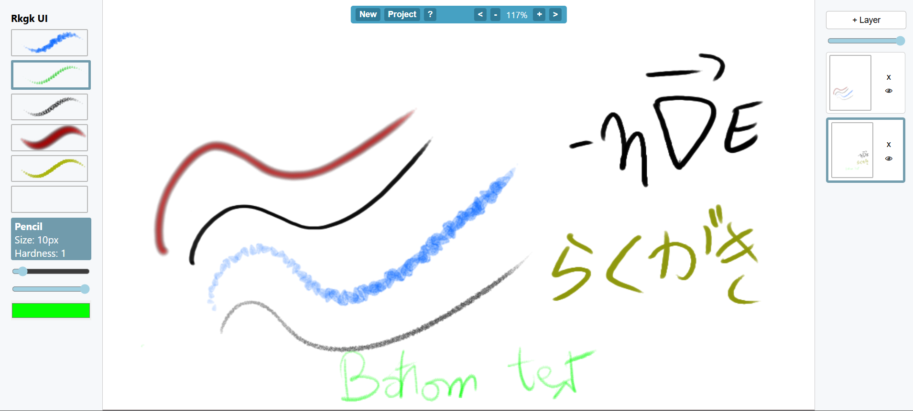
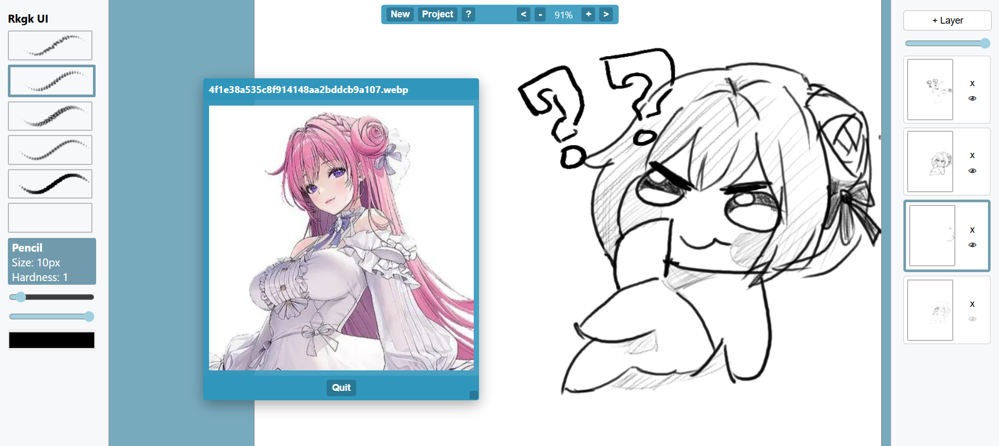

# rkgk

[rkgk](https://rkgk.afmichael.dev) (Rakugaki), sketch anything, on any device, on the fly. All you need is a browser.

# Motivations

How much does it take to build a fully functional, semi-professional, zero-bloat (0 dependencies) digital art app from scratch, one that runs in the browser with low latency?

Well, THIS much!

# Quick start

No installs, all you need is a server that can render static files.

```bash
# You most likely already have Python installed on your machine
# Just run this at the root directory and open http://localhost:4242
python -m http.server 4242
```

# Features

- Realistic line renders: pressure curve, pen tilt, pen orientation
- Fast/Snappy traces: should feel the same as drawing on paper, only friction should happen through the tablet material
- Custom brushes: hardness, color, size, procedural textures or images
- Layers composition: history, thumbnails, visibility, etc.
- Export/Import: **encrypted** rkgk project file

[rkgk.js](./src/rkgk/rkgk.js) is the core module, all it needs is a canvas or something that behaves like it.

Rkgk is designed to be easy to port into other languages. The event system is normalized to fit into an immediate mode drawing loop for synchronization.

# Rkgk UI

Rkgk UI is a full-fledged frontend for rkgk.

It showcases all the core aspect of rkgk, with some other neat additons.

## Good line fidelity

Only constraint is your drawing tablet's friction.




## Easy to work with reference images

Simply drag & drop any image to the window




Checkout the [rkgk demo](https://rkgk.afmichael.dev/demo) to see the core features in action, or maybe try [Rkgk UI](https://rkgk.afmichael.dev) for a full fledged semi-professional digital art app.


# Boring details

Possibly the most uninteresting part for most.

## .rkgk binary file format

This is the real reason I started this project. I've always wanted a way to share project files online, where the final artwork is viewable but the layers remain private.

rkgk binary file format is also dumb simple and designed to be easy to extend.

```
| rkgk    | meta json len | meta json string | Encrypted images |  
|         |               |                  |                  |
| 4 bytes |    4 bytes    |  meta json len   |        ??        |
```

The idea is that within the `meta json string`, we can just refer to the offset of the encrypted images.

For a complete understanding, it would be easier to directly read the implementation in [rkgk.js](./src/rkgk/rkgk.js), it is very short, it's used within the `Serializer` class.

This is the specification for the current version (v2). It is a hybrid binary/JSON format for storing layered canvas projects with AES-GCM encryption.

 * File structure:

```
 +--------+-----------+-------------------+----------------------------+
 | Offset | Size (B)  | Name              | Description                |
 +--------+-----------+-------------------+----------------------------+
 | 0      | 4         | Magic Number      | Constant ASCII "RKGK"      |
 | 4      | 4         | JSON Length       | Uint32 (LE) size of Header |
 | 8      | N         | JSON Header       | UTF-8 encoded metadata     |
 | 8 + N  | Variable  | Binary Payload    | Concatenated encrypted     |
 |        |           |                   | ImageData Blobs            |
 +--------+-----------+-------------------+----------------------------+
```

 * JSON header schema:
 ```
 {
  "title": string,              // Project name
  "currentLayerId": string,     // ID of the active layer
  "encryption": {
    "scheme": string            // "aes-gcm-pbkdf2-v1"
   },
  "layers": [                   // Array of layer metadata
  {
    "id": string,
    "isVisible": boolean,
    "opacity": number,
    "width": number,
    "height": number,
    "iv": number[],           // 12-byte Initialization Vector
    "salt": number[],         // 16-byte PBKDF2 Salt
    "offset": number,         // Byte offset relative to Binary Payload start
    "length": number          // Size of encrypted buffer in bytes
  }
 ],
 "finalImage": {               // Flattened preview metadata
   "offset": number,
   "length": number,
   ...cryptoMeta
  }
 }
 ```

* File generation:
1. Key Derivation: PBKDF2 (SHA-256, 150k iterations)
2. Algorithm: AES-GCM (256-bit key)
3. Salt: Unique per layer, which is mixed with an optional APP_SIGNATURE at derivation time
